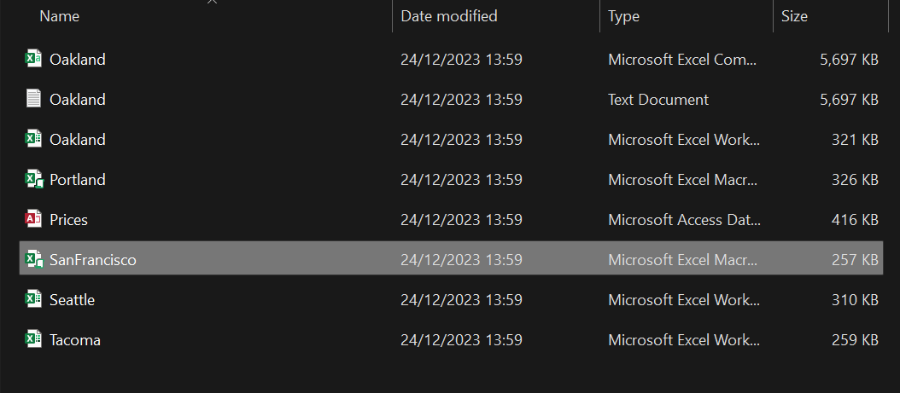

# Data-Transformation-in-Excel-1
This data transformation briefly works through a process of loading excel formats directly from a folder. each folder contains same information with equal of number columns. The idea is to create an ETL process that loads data from a folder, transforms it and append them together into a consolidated table. 

#### Excel file folder showing sales information for different sales person in different region. Additionally a random file of different file format

#### The file contains sales information of different sales person

#### Loaded view of folder and the different file formats available

#### Filtered view showing only needed xls formats

#### After keeping only xls format files, other unwanted columns are removed. Additionally a new custom column is created using the M code: Excel.workbook([content]) which returns the data in the content column

#### After expanding the created custom column, more columns are returned with focus on the 'Kind' column

#### The Kind column is filtered keeping only the 'Sheet' kind. After this only the needed columns remain, which are: city, name(salesrep) and data which contains the actual data we need. (columns are rearranged based on desired final outcome look)

#### After the data is expanded we have this

#### the data types of the columns are changed to requred type. The transformation is closed and loaded into an Excel worksheet where  analysis like the Pivot table and chart can be carried out. Additionally, as new data is added, once refreshed, the transformation process will automatically be applied and data updated.

Thank you 😄😄
